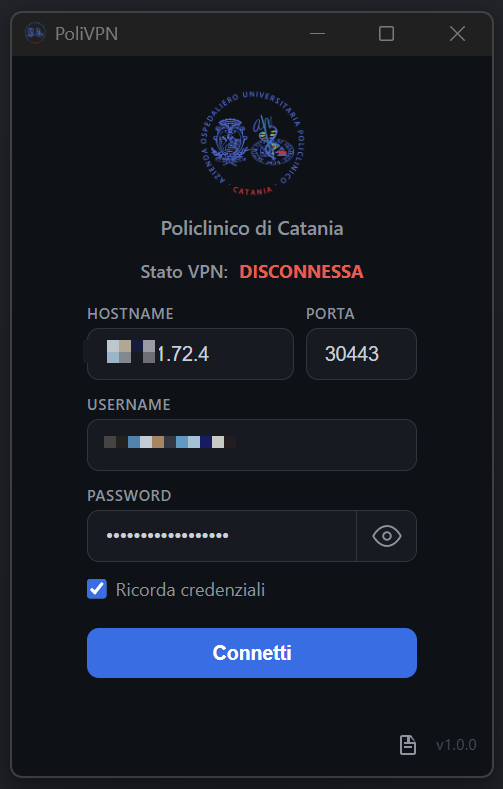
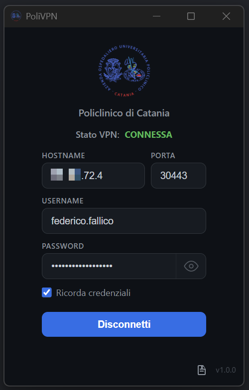

# PoliVPN

Client VPN desktop leggero e nativo per chi si connette a gateway **Fortinet SSL-VPN**. Il progetto nasce come alternativa open-source al FortiClient ufficiale, con interfaccia semplice e codice modulare in **Rust**. Puoi **personalizzare** testi (es. titolo sotto il logo via variabili di build) e **immagini** del client sostituendo gli asset in `vpn-app/src/` (logo) e la configurazione Tauri / tema.

### Screenshot (Windows)

Interfaccia principale in stato **disconnesso** e **connesso** (branding e titolo sotto il logo sono esempi configurabili in build).





---

## Cosa fa

- **Autenticazione** sul gateway Fortinet SSL-VPN (username / password, senza flussi 2FA/SAML nel percorso attuale).
- **Tunnel PPP/LCP/IPCP** e traffico IP su TLS secondo il modello usuale degli **gateway Fortinet SSL‑VPN**.
- **Interfaccia Tauri** minimale: gateway, utente, password, opzione “Ricordali” (default attivo), sottotitolo sotto il logo (testo cablato in compilazione, default **Connessione VPN**), pulsante Connetti/Disconnetti, finestra **Log** separata per diagnostica. La modalità **full-tunnel** vs **split-tunnel** su Windows è scelta **in compilazione** (`POLIVPN_VPN_TYPE`), non dal modulo.
- Su Windows, i comandi `netsh` / PowerShell usati per route e DNS partono **senza finestre console** visibili (`CREATE_NO_WINDOW`).
- Su Windows: supporto **MSI** (installer WiX); l’installer **include** `wintun.dll` nelle risorse del progetto e nel bundle (dettaglio in **[Wintun (Windows)](#wintun-windows)**).

### Wintun (Windows)

**Wintun** è il componente dedicato (**`wintun.dll`**) che su Windows permette all’app di usare un’**interfaccia TUN virtuale**, evitando installazioni TAP aggiuntive lato utente. PoliVPN lo utilizza tramite il crate Rust `tun` per trasportare nel sistema operativo il traffico del tunnel.

Nel **pacchetto installabile** (es. MSI delle Release), la **`wintun.dll`** è **già incorporata**: non viene richiesto alcun scaricamento separato all’utente finale. Sul disco di sviluppo risiede come risorsa sotto **`vpn-app/src-tauri/resources/`** e nell’installer finisce nella cartella **`resources`** del bundle; all’avvio l’app ne risolve il percorso e chiama **`vpn_core::tun::set_wintun_dll_path`**.

Per la **distribuzione e la conformità alla licenza** di terzi fare riferimento al **testo licenza** contenuto nel pacchetto ufficiale Wintun e alle indicazioni pubblicate sul sito [wintun.net](https://www.wintun.net/).

---

## Struttura del repository

Il codice Rust è diviso in due contesti Cargo:

- **Workspace alla radice** (`Cargo.toml` in questa cartella): membri **`vpn-core`**, **`vpn-helper`**, **`vpn-cli`**, con dipendenze condivise nel workspace.
- **App desktop** (`vpn-app/src-tauri/`): workspace Cargo **autonomo** per Tauri; dipende da **`vpn-core`** tramite path (`../../vpn-core`) e non compare nei `members` del manifest di radice.

Il template **`[.env.example](.env.example)`** nella radice descrive le variabili di compilazione MSI; **`polivpn.build.env`** e **`.env`** (locali, in `.gitignore`) contengono i valori reali quando compili tu stesso il client. CI in **`.github/`** usa lo stesso schema — vedi [`.env`, `polivpn.build.env` e MSI](#polivpn-env-msi).

### Cartelle principali

| Percorso | Contenuto |
|----------|-----------|
| **`vpn-core/`** | Libreria Rust con tutta la logica VPN: autenticazione HTTPS sul gateway Fortinet, parsing della configurazione XML, tunnel TLS, negoziazione PPP (LCP/IPCP), interfaccia TUN (tramite crate `tun` / Wintun su Windows), loop di I/O pacchetti. È il **cuore** del client: sia l’app grafica sia gli strumenti da terminale la usano come dipendenza. |
| **`vpn-app/`** | **Client desktop** distribuito agli utenti: shell **Tauri 2**. Dentro trovi il frontend web e il backend Rust. |
| **`vpn-app/src/`** | Interfaccia utente (HTML/CSS/JS, build con **Vite**): schermata principale, asset statici (logo, ecc.). |
| **`vpn-app/src-tauri/`** | Progetto Rust Tauri: `Cargo.toml`, `tauri.conf.json`, merge **`tauri.windows.conf.json`** / **`tauri.macos.conf.json`** (risorse e bundle per piattaforma), icone, `resources/` (solo Windows: `wintun.dll`), backend (`src/`). Artefatti in `src-tauri/target/`. |
| **`vpn-cli/`** | **Opzionale, solo per sviluppatori.** Binario da terminale che ripete lo stesso flusso di connessione di `vpn-core` con argomenti `clap` (gateway, utente, password, …). Serve per **debug**, CI o script senza avviare la GUI; **non** è il prodotto che installi sugli PC degli utenti e **non** va confuso con il client Tauri. |
| **`vpn-helper/`** | Binario di supporto per **operazioni privilegiate** su Windows (creazione/rimozione TUN, route, DNS) tramite API Win32. In `vpn-core` esistono moduli (`dns`, `routes`) pensati per **invocare** questo eseguibile quando si integrano quelle funzionalità; il legame è da considerare **di infrastruttura** rispetto alla GUI. |

### In sintesi

- **Utente finale:** usa solo il risultato della build di **`vpn-app`** (MSI / installer) oppure gli installer delle **[Release](https://github.com/oceanor/PoliVPN/releases)** su GitHub.
- **Manutenzione del protocollo e della connessione:** si lavora principalmente su **`vpn-core`** e sul backend in **`vpn-app/src-tauri`**.
- **`vpn-cli`** e **`vpn-helper`** sono complementi nel repo (debug / operazioni di sistema), non “altri programmi” che l’utente debba cercare e installare da sé, salvo decisioni future di packaging esplicito.

---

## Requisiti

**Solo esecuzione del client installato**

- Dagli artefatti precompilati nelle **[Release](https://github.com/oceanor/PoliVPN/releases)** non servono toolchain di sviluppo (**Rust**, **Node/npm**, ecc.): installi l’MSI (Windows) o il bundle macOS pubblicato nella release e utilizzi l’applicazione. Restano comunque richiesti i **permessi amministrativi** laddove il sistema operativo e il driver TUN lo richiedano.

**Sviluppo e compilazione da sorgente**

- **Rust** (edition 2021, toolchain stabile consigliata).
- **Windows:** privilegi **Amministratore** per creazione TUN e modifiche di routing/DNS durante l’uso; per compilare da sorgente serve la **`wintun.dll`** per l’architettura di build nella cartella **`vpn-app/src-tauri/resources/`**, come nell’installer precompilato (vedi **`vpn-app/src-tauri/build.rs`** per la preparazione nel tuo checkout). Licenza come da materiale su [wintun.net](https://www.wintun.net/).
- **Tauri CLI** per build dell’installer (`cargo install tauri-cli` oppure binario precompilato).
- **WiX Toolset v3** (o scaricato automaticamente dal bundler Tauri in molti ambienti) per generare l’**MSI**.

---

## Build rapida

### Workspace di radice (`vpn-core`, `vpn-helper`, `vpn-cli`)

Dalla **radice del repository**:

```bash
cargo build --workspace --release
```

Artefatti tipici in `target/release/` della radice:

- `vpn-cli` / `vpn-cli.exe` — solo per sviluppo / test (vedi sopra).
- `vpn-helper` / `vpn-helper.exe` — helper privilegiato Windows (route/DNS/TUN), da distribuire solo se integrate quelle funzionalità nel packaging.

### Applicazione grafica + MSI (Windows)

Per generare l’MSI, dalla cartella **`vpn-app`** (serve la **Tauri CLI**, vedi Requisiti):

```bash
cd vpn-app
cargo tauri build --bundles msi
```

Per lo sviluppo dell’interfaccia con hot reload si usa in genere **Vite** (`npm install` e `npm run dev` sempre dalla cartella `vpn-app`).

Output tipico dell’MSI:

`vpn-app/src-tauri/target/release/bundle/msi/PoliVPN_*_x64_it-IT.msi`

### Applicazione + DMG (macOS)

La compilazione **nativa** per macOS (bundle `.app` / `.dmg`) richiede **macOS con Xcode / toolchain Apple**. Da Windows o Linux non è supportata ufficiale per Tauri.

- Sul Mac, dalla cartella **`vpn-app`**:

```bash
rustup target add aarch64-apple-darwin x86_64-apple-darwin
cargo install tauri-cli --locked
cargo tauri build --target universal-apple-darwin --bundles dmg
```

Il DMG finisce sotto `vpn-app/src-tauri/target/universal-apple-darwin/release/bundle/dmg/`.

- Su **GitHub Actions** è incluso il job **`bundle-macos-dmg`**, che su ogni push/PR produce il DMG come **artifact** scaricabile (runner `macos-latest`).

**Config:** `tauri.windows.conf.json` aggiunge al bundle solo **`wintun.dll`**; `tauri.macos.conf.json` limita il target bundle a **DMG** senza quella DLL.

<a id="polivpn-env-msi"></a>
#### `.env.example`, `.env`, `polivpn.build.env` e MSI

Spesso si confonde il file **`.env`** (tipico dei progetti Node) con quanto serve per produrre un installer.

| Domanda | Risposta |
|--------|----------|
| Serve il file **`.env`**? | **No, non è obbligatorio.** È solo **uno dei modi** per dare gateway/porta alla build in locale: è in **`.gitignore`**, quindi **non finisce su GitHub** se non forzi il commit. Alternativa equivalente: file **`polivpn.build.env`** (anche questo **ignorato**, non versionare con valori riservati se il repo è condiviso). |
| Cosa **committare**? | **`[.env.example](.env.example)`** (placeholder nella radice). In CI definire **`POLIVPN_*`** come variabili del runner se vuoi default di build lì. |
| Come legge la build i default MSI? | `vpn-app/src-tauri/build.rs` legge dalla radice, in ordine: **`polivpn.build.env`**, poi **`.env`**. Chiavi supportate: `POLIVPN_DEFAULT_GATEWAY`, `POLIVPN_DEFAULT_PORT`, `POLIVPN_VPN_TYPE` (o alias `VPN_TYPE`), `POLIVPN_TITLE` (o alias `TITLE`). Se assenti, puoi esportare le stesse variabili nella **shell** prima di `cargo tauri build`. |
| `.env.example` viene letto dalla build? | **No.** Copiarlo nella radice come **`.env`** o **`polivpn.build.env`**, che la build legge nell’ordine indicato sopra. |

#### Gateway e porta cablati nell’MSI (distribuzione)

Per un MSI che propone **gateway e porta Fortinet** già compilati nel binario: all’avvio vengono **precompilati** nel client; **non** sono bloccati — l’utente può modificarli prima di connettersi (come per una build senza queste variabili).

**Locale / CI:** dalla radice, copia **[`.env.example`](.env.example)** in **`polivpn.build.env`** o **`.env`** (non versionati). Oppure definisci **`POLIVPN_*`** solo nell’ambiente del job di build.

```env
POLIVPN_DEFAULT_GATEWAY=vpn.esempio.it
POLIVPN_DEFAULT_PORT=443
# Opzionali:
# POLIVPN_VPN_TYPE=FULL
# POLIVPN_TITLE=Connessione VPN
```

Ordine di lettura: prima **`polivpn.build.env`**, poi **`.env`** (quest’ultimo **sovrascrive**). Chiavi non riconosciute vengono ignorate.

| Variabile | Quando | Effetto |
|-----------|--------|---------|
| `POLIVPN_DEFAULT_GATEWAY` | Solo **durante la compilazione** di `polivpn-app` | Valore iniziale nel campo gateway. |
| `POLIVPN_DEFAULT_PORT` | Idem | Valore iniziale nel **campo porta** (usato in `connect`). |
| `POLIVPN_VPN_TYPE` (alias `VPN_TYPE`) | Idem | `FULL` (default se omesso): tunnel IPv4 full sul client Windows. `SPLIT`: route split dall’XML; il gateway deve inviare gli **`<addr>`** nella config VPN. |
| `POLIVPN_TITLE` (alias `TITLE`) | Idem | Testo sotto il logo nell’UI. Se omesso o vuoto: **Connessione VPN**. |

**PowerShell** (alternativa ai file), stessa sessione della build:

```powershell
$env:POLIVPN_DEFAULT_GATEWAY = "vpn.azienda.it"
$env:POLIVPN_DEFAULT_PORT = "443"
# Opzionale: $env:POLIVPN_VPN_TYPE = "FULL"
# Opzionale: $env:POLIVPN_TITLE = "Connessione VPN"
cd vpn-app
cargo tauri build --bundles msi
```

**Bash** (Linux/macOS o Git Bash), equivalente alle variabili shell:

```bash
export POLIVPN_DEFAULT_GATEWAY="vpn.azienda.it"
export POLIVPN_DEFAULT_PORT="443"
# Opzionale: export POLIVPN_VPN_TYPE="FULL"
# Opzionale: export POLIVPN_TITLE="Connessione VPN"
cd vpn-app && cargo tauri build --bundles msi
```

Gateway e porta **non** sostituiscono utente e password: indicano solo **a quale server** collegarsi. Per sedi o gateway diversi servono in genere **MSI distinti** (in alternativa futura: config distribuita da policy senza ricompilare).

---

## Sicurezza e conformità

- Il progetto può essere configurato per accettare certificati TLS non standard nel contesto di gateway interni; questo **riduce le garanzie usuali di TLS**. Usare solo su reti e gateway di cui ci si fida e come da policy aziendale.
- **Non è un prodotto Fortinet ufficiale** né è affiliato a Fortinet. Il marchio FortiClient / Fortinet è proprietà dei rispettivi titolari.
- Per pubblicazione su GitHub: valutare l’aggiunta di una **LICENSE** esplicita e di una policy di **security disclosure** se il repository è o diventa pubblico.

---

## Contribuire

Issue e pull request sono benvenute (documentazione, robustezza, supporto macOS, packaging). Mantieni gli esempi senza dati personali né credenziali reali.

---

## Riferimenti tecnici

- **Tauri:** https://tauri.app/
- **Wintun:** https://www.wintun.net/

---

*Il nome “PoliVPN” è storico/decorative; puoi rinominarlo nel branding del tuo fork o build personalizzata.*
